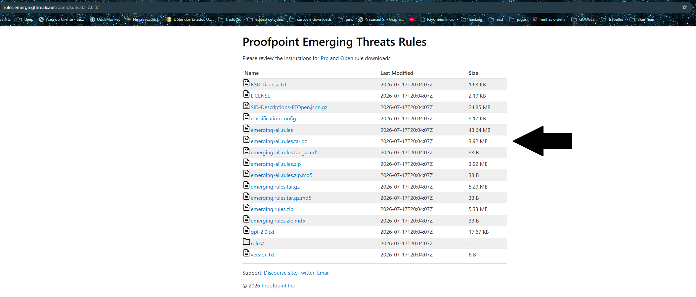
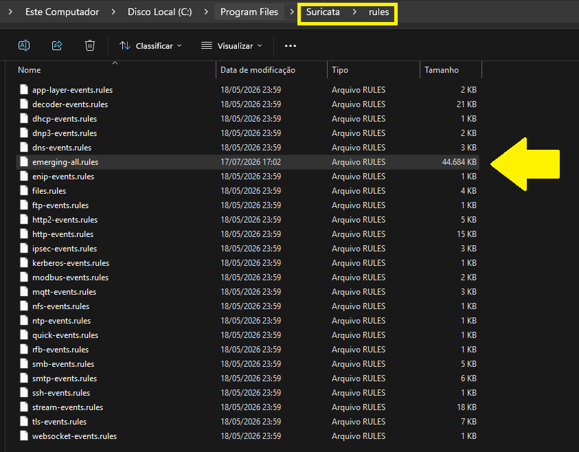
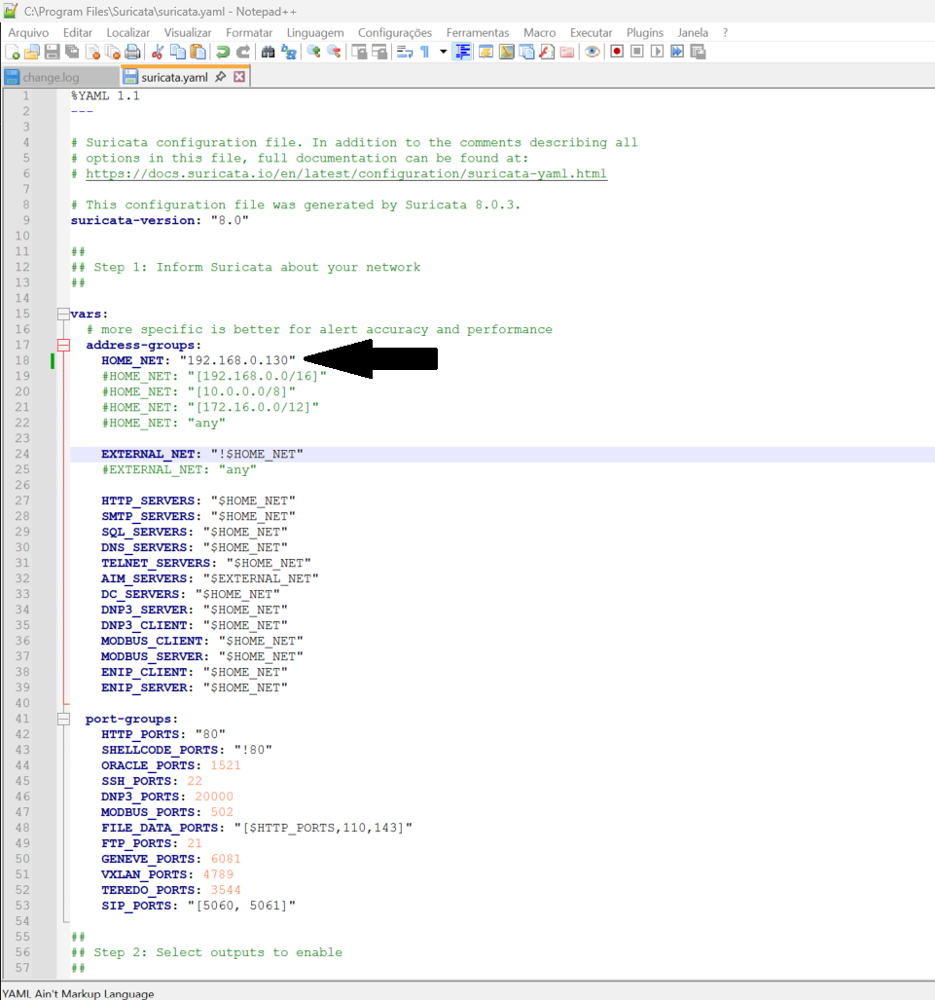
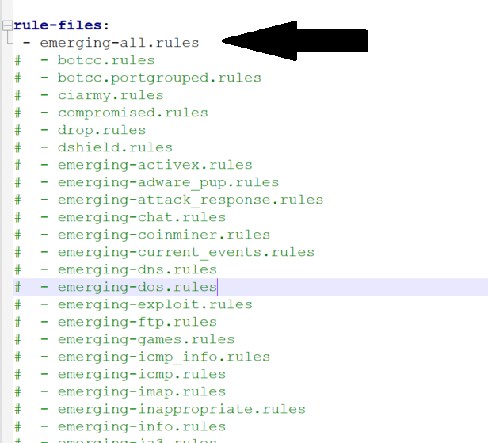
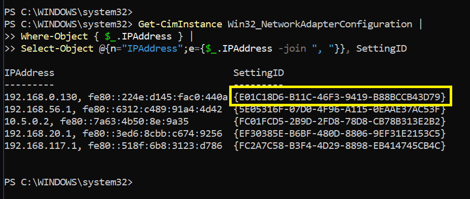
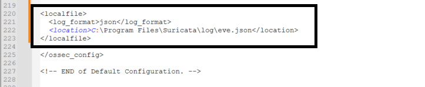
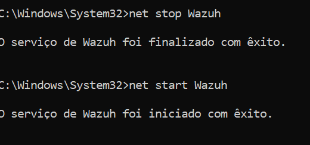

# Instalação do Suricata no Windows 11 integrado ao Wazuh

Este guia contém o passo a passo para instalar o Suricata em uma máquina Windows 11 e integrá-lo com o Wazuh Agent para o envio de alertas.

🎥 **Vídeo de Referência:** [YouTube - Instalação Suricata no Windows 11](https://www.youtube.com/watch?v=7j4aGb5qnrE&list=PLHjuPxrwcdsZub-nvo_yKgCu-KwSn2qTn&index=6)

---

## 🛠️ SURICATA

### 0. (OPCIONAL) Instalar Notepad++
Baixe e instale o Notepad++ para facilitar a edição de arquivos:
[https://notepad-plus-plus.org/downloads/](https://notepad-plus-plus.org/downloads/)

### 1. Instalar o Npcap
Baixe e instale o Npcap (use as opções padrão durante a instalação):
[https://npcap.com/#download](https://npcap.com/#download)

### 2. Instalar o Suricata
Baixe e instale o Suricata normalmente:
[https://suricata.io/download/](https://suricata.io/download/)

### 3. Baixar as regras do Suricata
Baixe o arquivo `emerging-all.rules` no link abaixo:
[https://rules.emergingthreats.net/open/](https://rules.emergingthreats.net/open/)




Após o download, copie o arquivo para a pasta de regras do Suricata:
`C:\Program Files\Suricata\rules`



### 4. Descobrir o seu IP (HOME_NET)
Abra o **CMD** e execute:
```cmd
ipconfig
```
Copie o seu Endereço IPv4.

### 5. Editar o arquivo de configuração do Suricata
Edite o arquivo `C:\Program Files\Suricata\suricata.yaml` e altere a variável `HOME_NET` para o seu IPv4 (substitua `[**IPWINDOWS11**]` pelo seu IP real):

```yaml
address-groups:
    HOME_NET: "[**IPWINDOWS11**]"
```



Na mesma configuração, ajuste os arquivos de regras (`rule-files`) para incluir o que acabamos de baixar:
```yaml
rule-files:
 - emerging-all.rules
```



### 6. Descobrir o UUID da placa de rede
Para iniciar o Suricata, precisamos do identificador único (UUID) da sua interface de rede.

Abra o **PowerShell** e execute o comando abaixo (as versões mais novas do Windows depreciaram o comando `wmic`):
```powershell
Get-CimInstance Win32_NetworkAdapterConfiguration |
Where-Object { $_.IPAddress } |
Select-Object @{n="IPAddress";e={$_.IPAddress -join ", "}}, SettingID
```
*Anote o UUID (SettingID) que corresponde ao seu IP.*



### 7. Iniciar o Suricata
Abra o **CMD como administrador** e execute o seguinte comando, substituindo `{*************UUID*************}` pelo UUID que você encontrou no passo anterior:

```cmd
"C:\Program Files\Suricata\suricata.exe" -c "C:\Program Files\Suricata\suricata.yaml" -i \Device\NPF_{*************UUID*************}
```

*(Para testar, você pode realizar um ping a partir de outro computador e verificar se os alertas estão sendo gerados no arquivo `C:\Program Files\Suricata\log\eve.json`)*.

---

## 🛡️ Configurar Wazuh-Agent

### 8. Integrar os logs com o Wazuh
Edite o arquivo de configuração do Wazuh Agent:
`C:\Program Files (x86)\ossec-agent\ossec.conf`

Adicione as linhas abaixo dentro da seção `<ossec_config>` para coletar os alertas no formato JSON:

```xml
<ossec_config>
...
  <localfile>
    <log_format>json</log_format>
    <location>C:\Program Files\Suricata\log\eve.json</location>
  </localfile>
...
</ossec_config>
```



### 9. Reiniciar o serviço do Wazuh-Agent
No **CMD como administrador**, execute:
```cmd
net stop Wazuh
net start Wazuh
```



### 10. Validar
Acesse o seu Wazuh Dashboard e verifique se os alertas gerados pelo Suricata começaram a chegar!

---

## ⚙️ CRIAR TAREFA PROGRAMADA (Início Automático)

Para que o Suricata inicie automaticamente com o Windows:

1. Abra o **Programador de Tarefas** (Task Scheduler) no menu Iniciar.
2. Clique em **Criar tarefa básica...** (Create Basic Task).
3. Dê um nome à tarefa (por exemplo, `Suricata IDS`).
4. Em *Disparador* (Trigger), escolha **Quando o computador for iniciado** (When the computer starts).
5. Em *Ação* (Action), selecione **Iniciar um programa** (Start a program).
    * **Programa/script:** `"C:\Program Files\Suricata\suricata.exe"`
    * **Adicione os argumentos:** `-c "C:\Program Files\Suricata\suricata.yaml" -i \Device\NPF_{*************UUID*************}` *(Não esqueça de colocar o seu UUID real)*.
6. Avance e **Conclua** para salvar a tarefa.
